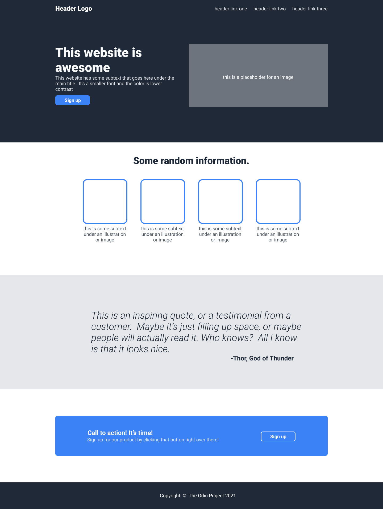

# Project: Landing Page "God Watches"

This project is a complete landing page built from scratch, based on a design provided by The Odin Project. The main goal was to replicate a modern web design using HTML and CSS, with a strong focus on **Flexbox** for the layout.

The page was adapted as a concept site for a watch brand named "God Watches".

## Screenshot (Desktop)

*(Note: This is the reference image for the design. The final project replicates this structure.)*

---

## 🚀 Features

* **Header & Hero:** A combined top section with a dark background, logo, navigation links, and a "hero" with a main call-to-action and a product image.
* **Information Section:** A "features" section displaying four key product characteristics (watches) in horizontally-aligned boxes.
* **Quote Section:** An inspirational quote or testimonial block with a contrasting background to break up the content.
* **Call to Action (CTA) Section:** A final banner to capture the user's attention with a secondary sign-up button.
* **Footer:** A simple footer with copyright information.

---

## 🛠️ Technologies Used

* **HTML5:** Used for the page structure.
* **CSS3:** Used for all styling, colors, fonts, and layout.
* **Flexbox:** The primary CSS technology used to align all major sections and elements, from the header and info boxes to the footer centering.

---

## 🔮 Future Improvements

While the visual layout is complete, I plan to refactor the HTML in the future to be more **semantic**.

This will include replacing generic `divs` with more appropriate tags such as:
* `<header>`
* `<nav>`
* `<main>`
* `<section>`
* `<aside>`
* `<footer>`

This will improve the page's accessibility (a11y) and SEO.

---

## 📜 Acknowledgements

* This project was part of **The Odin Project** curriculum.
* All watch images were sourced from **Unsplash**, **Pexels**, and **Pixabay**.